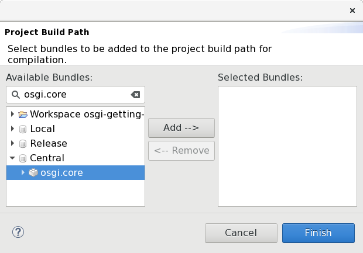
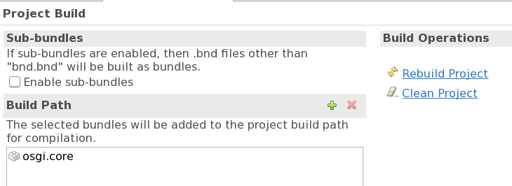

# Bndtools

[Bndtools](https://bndtools.org/) is an Eclipse plugin that integrates the (command line) tool [bnd](https://bnd.bndtools.org/) in Eclipse and provides "continuous build" for bundles. [Install](https://bndtools.org/installation.html) it now[^bndtools-version].

[^bndtools-version]: This chapter was originally written using bndtools 3.2.0. However, the current version has been updated to comply with bndtools 4.2.0 and Eclipse 2019-03.

The tool bnd takes a different perspective on defining bundles. From bnd's point of view, `MANIFEST.MF` is the source of information about the bundle at runtime only. While developing the bundle, you need closely related, but sometimes slightly different information and  *additional* information. So, to bnd, `MANIFEST.MF` is an artifact that is generated during build time from information contained in a file called `bnd.bnd`. The eclipse plugin bndtools provides a GUI for editing `bnd.bnd` (again with the possibility to edit the source directly) and components that make the information from `bnd.bnd` available to Eclipse's continuous build. 

There is a [tutorial](https://bndtools.org/tutorial.html) for Bndtools, which I found (at the time of this writing) to be rather confusing[^lastLook]. It addresses developers with some OSGi experience rather than users who want to get an (Eclipse based) environment for writing their first bundle. So let's simply once more focus on our Simple Bundle and port it to a Bndtools project.

[^lastLook]: When I last had a look at it, it was marked as "out of date" and as
    to be replaced by something new. So when you read this, maybe things
    have changed for the better already.

## Creating the Projects

In order to be able to work with Bndtools without problems, you need a so called configuration project (a.k.a bnd workspace). Bndtools is a great Eclipse 
plugin, but ... during the last 
three years there has never been a version which was distributed with up-to-date templates for the wizard that creates the configuration project (or a bundle project). So 
open "Window/Preferences/Bndtools/Repositories", "Enable templates repositories"
and restart Eclipse[^templDefault].

[^templDefault]: No idea why they don't make this the default seeting.

Now use the wizard to create a "Bndtools OSGi Workspace" (File/New/Other/Bndtools).
Choose the "Minimal workspace", everything else is outdated.
You'll see a project `cnf` having been created in your workspace. Ignore it for the time being. Use the wizard again and create a new "Bndtools OSGi Project". Choose the Bndtools/Empty template and use `SimpleBundle-bnd` as project name.

Have a look at the `generated` folder in `SimpleBundle-bnd`. Double-click on `SimpleBundle-bnd.jar` (ignore the error dialog) and then&mdash;in the "Jar File Viewer" that 
appears&mdash;double-click on `MANIFEST.MF`. Looks a bit familiar but much 
more verbose than what we have written so far[^sb]:

[^sb]: Probably this is really the *simplest bundle* that you can have.  

{: width="700px" }

## Adding our Code

Copy our source package into the `src` folder of the new project. Open `Activator.java` and have a look at the error. Looks familiar. Regrettably, there's no quick fix this time.

What we first have to do is to provide the bundle with the OSGi Core API (again).
In the "plain Java" project, we simply added a jar to the project. In the Eclipse PDE 
project, the wizard found the bundle because "it happened to be available" in 
Eclipse. Bndtools can also search for bundles, but we first 
have to configure a so called "repository", a searchable provider of bundles. 
This could be done in the projects's `bnd.bnd` but as we are going to need the repository 
most likely in several projects, it's preferably done in the
configuration project's `cnf/build.bnd`.

We'll have a detailed look at repositories later. For now you should simply
copy the files `build.bnd` and `pom.xml` from the 
[sample project](https://github.com/mnlipp/osgi-getting-started/tree/master/cnf) 
into the `cnf/` directory, switch to the Bndtools perspective and choose 
"Bndtools/Refresh Repositories" from the menu (or click on the refresh button
at the top of the "Repositories" view). 
When you go back to `Activator.java` and look at the quick fix proposals for the
error at the import statement, it offers to "Add bundle 'osgi.core' to Bnd
build path'. Do this. It will fix all errors. 

As an alternative to using the quick fix, open `bnd.bnd` and 
select the "Build" tab. In the "Build Path sub-window use "+" to add `osgi.core`
(use the search field to find the bundle in the repositories). 

{: width="370px" }

Click "Finish" and the osgi.core bundle can be found in the "Build Path" 
section of `bnd.bnd`'s "Build Tab".

{: width="400px" }

Save the file, click on "Rebuild project" (under "Build Operations") and see the error disappear.

## Completing the Bundle Configuration

No matter how you fixed the compilation problems, open `bnd.bnd`, go to tab "Contents"
and add the bundle's activator. You can use content assist to enter the class name into the field (it's the only proposal). Save again, and in the Jar file viewer, you can see the `Bundle-Activator` header having been added to the generated `MANIFEST.MF`. You can also see it on the "Source" tab of `bnd.bnd`. The basic idea about the format of `bnd.bnd` is that entries that are to be copied to `MANIFEST.MF` look just like the headers in `MANIFEST.MF` (well, sometimes they are processed a bit). Entries that control the behavior of the bnd tool start with a dash[^cwp].

[^cwp]: Comparing this with PDE's approach as shown in the previous part, you could say that `bnd.bnd` combines the information maintained by PDE in `MANIFEST.MF` and `build.properties`.

Add version "1.0.3" in the "Content" tab of `bnd.bnd`. Save, and you can immediately install and start the bundle (the jar) in felix as with our previous projects. If you want to have a build time stamp as with the PDE plugin, add `${tstamp}` to the version number ("1.0.3.${tstamp}"). This macro will be replaced with the build time by bnd.

## More about Bnd/Bndtools

If you want to continue using Bndtools, you should have a look at the [bnd documentation](https://bnd.bndtools.org/) after reading the remaining parts of my introduction (at least up to "Cleaning up" -- there are still some pieces of the puzzle missing). I recommend to start with "[Introduction](https://bnd.bndtools.org/chapters/110-introduction.html)", proceed with "[Concepts](https://bnd.bndtools.org/chapters/130-concepts.html)" and read the rest as required when you encounter problems with your projects. There's also
a partially redundant (but more to the point) 
[introduction to bnd workspaces](https://bndtools.org/concepts.html) available
as part of the bndtools documentation[^astonishDoc].

[^astonishDoc]: After following the development of bnd/bndtools for more than three
	years by now, I find it a bit astonishing that the same people who write the precise,
    enterprise targeted, formal OSGi specifications make such a mess of their 
    tooling documentation. IMHO the "Bndtools Workspace Conepts" (subtitled  
    "Introduction to the basic bnd workspace model") should simply
    be a chapter in a (cleaned up) bnd documentation, instead of an independent
    part of an (otherwise rather sparse) bndtools documentation that can only
    be fully understood when reading the bnd documentation in parallel[^misunderstand].
    
[^misunderstand]: Don't get me wrong, I appreciate the work of everybody who
	participates in the development of bnd/bndtools and I'm very thankful
	that these tools exist, especially for free!

## Gradle Build

Bndtools is made to cooperate with the [Gradle Build Tool](https://gradle.org/).
Because we chose the "Minimal Workspace" when creating the "Bndtools OSGi workspace",
we didn't get the required files for a gradle build automatically. The other templates
would have generated these files. However, 
at the time I write this, they create files that are outdated with respect 
to the current version of the bnd/bndtools gradle plugin. This isn't a big
problem, because by now (version 4.2.0) gradle support has become very easy to 
configure. You find all required information on the 
[gradle plugin's documentation page](https://github.com/bndtools/bnd/blob/master/biz.aQute.bnd.gradle/README.md#gradle-plugin-for-workspace-builds). 

If you want
to use the gradle build in parallel with the bndtools Eclipse plugin, you
should configure a "[Bnd Workspace build](https://github.com/bndtools/bnd/blob/master/biz.aQute.bnd.gradle/README.md#gradle-plugins-for-bnd-workspace-builds)"[^misnomer].
Because an OSGi based project consists more often than not of several bundles,
bundle projects are typically sub projects in a gradle project layout[^restructure].
In order to support a gradle build of the projects that we have created so far,
copy all gradle related files from the 
[sample project](https://github.com/mnlipp/osgi-getting-started) to your project
(tree) or create them yourself as explained in the bnd gradle plugin's
documentation.

[^misnomer]: Although it is, of course, correct that the non-workspace build
	does not require a `cnf` directory, while the workspace build does, it is
	better to think of the non-workspace build as a "gradle first" build (i.e.
	configuration is mostly done in `build.gradle`), while the workspace
	build is a "bnd first" build (i.e. configuration is mostly done in `bnd.bnd`).
	As the Eclise Bndtools plugin focuses on managing things with
	`bnd.bnd` files, it can be better combined with the workspace build. 

[^restructure]: A difficulty with this project layout is that you cannot see 
	the top level gradle project's files in Eclipse. This can be fixed by using 
	the nested project layout that Eclipse started to support with 
	version 4.5 (Mars). Create a new project of type "General" named 
	e.g. "OSGi-Tests". Delete the projects created so far
    from your workspace (it should only contain "OSGi-Tests" now) and close Eclipse. Move
    everything in your workspace (except folders "OSGi-Test" and ".metadata") into the
    folder "OSGi-Tests".
    Re-open Eclipse again and re-import the projects that are now sub-projects of
    "OSGi-Tests". Choose "Project Presentation: Hierarchical" in the "Project Explorer"
    window to see everything in Eclipse.

When you now type "`./gradlew clean build`" in the root projects you see, well, nothing.
The gradle build creates the bundle at exactly the same location
(`generated/SimpleBundle-bnd.jar`) as the continuous build by Eclipse. So to really
verify that the gradle build works, exit Eclipse first (or uncheck "Project/Build
Automatically"). 

To make absolutely sure that the dependencies between the tools are clear, let me
summarize. The Eclipse Bndtools feature provides plugins for Eclipse that support 
editing of `bnd.bnd` files, inspection of jars, and use the information from `bnd.bnd`
(and `cnf/build.bnd`) to provide a class path container for the continuous Eclipse 
build. It integrates `bnd` into Eclipse for the evaluation of the `bnd.bnd` files 
and the generation of the `MANIFEST.MF` as part of the continuous build.

At the center of the gradle workspace build is the same bnd tool. The "gradle plugin" provides  gradle task configurations (by applying the plugin) using the project specific build information from `bnd.bnd` (and `cnf/build.bnd`), thus making `bnd.bnd` the primary 
source of information for the gradle build (as far as bundles are concerned). The results from the Eclipse build and the gradle build are exactly the same. Using Bndtools in combination with gradle therefore does not make your project depend on Eclipse.

---
