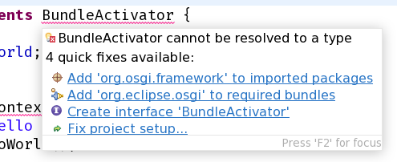

# Eclipse (OSGi) Plug-in

While the basic mechanisms of OSGi are quite simple, managing an OSGi project can easily get complicated. The dependency on the `BundleActivator` in our Simple Bundle provided a first taste: because of using that OSGi interface, we had to add a jar to the project and an import statement to the project's manifest. Surely, an IDE should provide some support for this.

You may have heard about OSGi for the first time -- just like I did -- when the Eclipse developers announced in 2003 that they'd use OSGi as foundation for the next Eclipse version. Since then, Eclipse has provided the Plug-in Development Environment (PDE) which is essentially a development environment for OSGi plug-ins. If it is not already included in your Eclipse installation, get it now[^ESWI].

Create a new plug-in project using the wizard. I used `SimpleBundle-plugin` as project name, because this is just a different way to build our Simple Bundle. You have to change two options while going through the dialogue. On the first page, make sure to choose a standard OSGi framework as target: 

{: width="500px" }

And on the last page uncheck the template option -- we want an empty project.

Looking at the resulting project, you'll find that it isn't completely empty after all. The wizard has created a `MANIFEST.MF` and a file `build.properties`.

{: width="250px" }

The `MANIFEST.MF` is here because PDE maintains almost the complete data required to build the bundle in that file. This sounds familiar, it's exactly what we have done in our previous, completely "manual" approach. The `build.properties` basically adds some information about the project layout and what to put additionally into the created jar (no need to use the export jar wizard any more). 

Double click on `MANIFEST.MF`. PDE provides a "graphical view" on the bundle configuration (the textual view is still there; if you want to see it, click on the last but one tab at the bottom of the window). The tabs "Overview", "Dependencies", "Runtime" and "Build" are essentially sophisticated forms for editing the information maintained in `MANIFEST.MF` (and `build.properties`). As is common with such views in Eclipse, you're free to enter information using the forms or edit the source directly. Try to change the bundle name to "HelloWorld" again using either approach.

Maybe the single most interesting feature about that sophisticated manifest editor is its support for managing dependencies. Copy the package with our two classes into the `src` folder of the new plugin project. Remove the import statements at the top of `Activator.java`. Move the cursor over the unknown `BundleActivator` and you'll see this popup:

{: width="330px" }

Adding an OSGi framework sounds like a very good idea, and if you choose this option, you find that Eclipse also adds an import statement for `BundleActivator`. Use the same "magic" to add an import for `BundleContext` and the errors are gone. Switch to the `MANIFEST.MF` (or the "Dependencies" tab) to check that the `Import` statement has been added. A reference to the jar providing this package has automatically been included in the project's classpath, too, as you can see in the project explorer. 

{: width="350px" }

Instead of adding the location of the jar directly, PDE adds the classpath container "Plug-In Dependencies". As content of this container, PDE supplies the jars that provide the packages enumerated in the `Import-Package` header of the manifest. You can see that PDE could locate `org.osgi.framework` in a jar that is part of the Eclipse Equinox package -- Eclipse's own implementation of the OSGi framework and base of Eclipse itself.

When you compare the manifest that has been created up to now with the manifest from our previous project, there should be 3 differences. First, PDE used the project's name to fill in the bundle symbolic name. Change that back to `io.github.mnl.osgiGettingStarted.simpleBundle` as this is the usual pattern for bundle symbolic names. Second, the version has been filled with `1.0.0.qualifier`. We should update the version to `1.0.1`. You can also keep the `qualifier` if you like. It is replaced with a time stamp at build time, thus assigning a unique version to each build.

Finally, the bundle activator is still missing. You could simply copy the line from the "old" `MANIFEST.MF`. But in order to gain some more PDE experience, you should rather switch to tab "Overview". In the top left section you find a browse button. It enables the users to browse through all classes known to Eclipse that implement the `BundleActivator` interface. Type some letters from `Activator` to restrict the list and choose the implementation from our project.

On the bottom right of the "Overview" window, there is a section "Exporting". Choose option 4 ("*Export the plug-in in a format suitable for deployment using the Export Wizard*"). Choose our plugin and "Directory" in the next dialog. Note that the plug-in will be created in a subdirectory ("`plugins/`") of your chosen directory. Install and start the created bundle in felix. 

This is the Eclipse "built-in" way of handling bundles. Although it works, it uses its own terminology and focuses on writing bundles (sorry, plug-ins) for the Eclipse environment. So unless you wanted to know about OSGi only as background for writing an Eclipse plug-in, Let's have a look at a more "pure OSGi" alternative.

---

[^ESWI]: You should know how to do this. If not look it up in the [Manual](https://help.eclipse.org/mars/index.jsp?topic=%2Forg.eclipse.platform.doc.user%2Ftasks%2Ftasks-124.htm).
