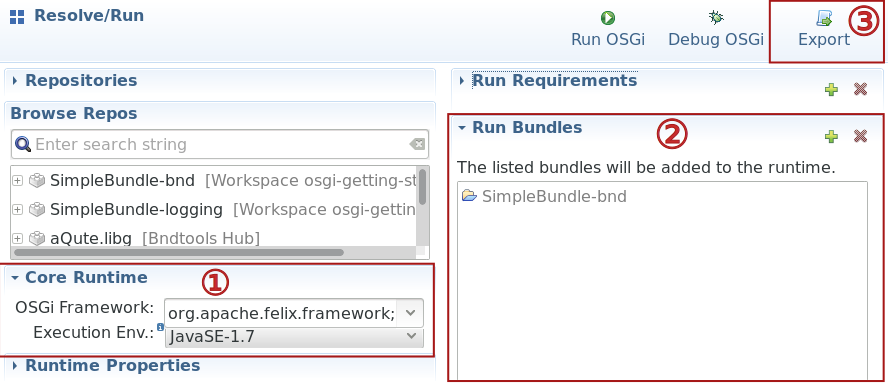

# Shift in Perspective

When presenting their software, OSGi framework providers tend to focus -- not surprisingly -- on the capabilities of the product. Among those is the possibility to deploy bundles dynamically from a console. We've used this capability throughout this introduction to test our bundle in various development stages. This might lead to the impression that the OSGi framework is a heavy weight -- or at least light heavy weight -- container[^j2ee], which is not true.

A more appropriate perspective on the OSGi framework focuses on the aspect that it is a framework: an environment providing some generic functionality to facilitate the development of software (see the [more exhaustive explanation](https://en.wikipedia.org/wiki/Software_framework) on Wikipedia). A characteristic of frameworks (contrary to libraries) is that they implement the startup code. The user-written code is invoked by the framework in a framework dependent way[^invok].

The capability to deploy bundles dynamically is a genuine functionality of the OSGi core framework, providing a console isn't. A minimal application using the OSGi framework therefore consists of the framework implementation and at least one bundle. Contrary to some other frameworks, OSGi doesn't provide the ``main`` method. In order to get things started, a minimal application must implement a ``main`` that creates an instance of [the framework](https://osgi.org/javadoc/r6/core/org/osgi/framework/launch/Framework.html), installs the bundle and starts the framework (which activates the installed bundle in turn). You can find a sample ``main`` in the OSGi Core specification, Chapter "Life  Cycle Layer", section "Frameworks" ([downloadable](https://www.osgi.org/developer/downloads/release-6/) from the OSGi web site)[^ownStartup].

[^ownStartup]: You should really have a look at the code in order to gain a thorough understanding of what happens. Nevertheless, I'm going to proceed with the ready-made solution here in order to avoid loosing my focus.

To simplify this task, Bndtools provides support for assembling such an application that consists of a framework, your chosen bundle(s), and some application startup code (though not a minimal version). Switch to the "Run" tab of the ``bnd.bnd`` graphical editor.

{: width="600px" }

Select the framework from the drop down box ①. We'll stick to using Felix here. The bundle under development is automatically added to the "Run bundles" ②. Use the button "Export" at the top right ③ to create the application. Test the created jar by running it with ``jar -jar your.jar``.

Looking at the content of the created jar, we find something like this (empty directory entries removed):

```
  1133 Tue Mar 29 12:25:36 CEST 2016 META-INF/MANIFEST.MF
  3994 Sun Jun 16 05:01:03 CEST 2097 aQute/launcher/pre/EmbeddedLauncher.class
  4717 Mon Mar 28 15:24:14 CEST 2016 jar/SimpleBundle-bnd.jar
147494 Wed Mar 16 18:00:28 CET 2016 jar/biz.aQute.launcher-3.1.0.jar
677905 Sun Mar 13 20:38:12 CET 2016 jar/org.apache.felix.framework-5.2.0.jar
  1583 Tue Mar 29 12:25:36 CEST 2016 launcher.properties
    57 Tue Mar 29 12:25:36 CEST 2016 start
    48 Tue Mar 29 12:25:36 CEST 2016 start.bat
```

Basically, the content appears as expected. There is the Felix framework jar and our bundle. The ``EmbeddedLauncher.class``[^st] and the ``bit.aQute.launcher`` provide the startup code that is configured -- from the settings on the "Run" tab -- by the ``launcher.properties``.

Looking at the sizes, you find that the core of the OSGI framework is about 680k, the "basic offset" for using OSGi. The size of ``SimpleBundle.jar`` appears to be a bit high, considering its simple content. Unpacking it reveals that it contains the source code of our classes in addition to the bytecode (the same applies to ``biz.aQute.launcher-3.1.0.jar``). Including the source code is the default behavior when bnd builds a jar. The source is put into the jar under ``OSGI-OPT/src`` where "OSGi-aware" IDEs will find it in a debugging session.

If you want the command shell to be part of your application again, add the bundles ``org.apache.felix.gogo.shell``, ``org.apache.felix.gogo.runtime`` and ``org.apache.felix.gogo.command`` in the "Run Bundles" field. Start the application with the augmented set of bundles and you can e.g. check the running bundles with ``felix:lb`` as you did before. To simplify application launch during development, Bndtools provides the "Run" button on the "Run" tab. It immediately starts the environment that you found in the exported bundle in the previous part.

Bndtools will remain the tool of choice for the remainder of this introduction. It's basically an Eclipse integration for the command line tool bnd[^mti]. The tool bnd is in turn at the core of all OSGi build tools that I have encountered. While it provides some sophisticated functions, it's easy to get started with, and the configuration and action directives in `bnd.bnd` are straightforward and easy to understand.

[^mti]: This is a bit unfair. Its possibility to deploy the bundle under development into a running framework gives you a really fast development cycle. I failed to find a description of this feature in the documentation, so it took me some time to find out about it. Make some change to the source code (adding a space somewhere is sufficient) while the OSGi framework that you started with the "Run" button is running. Save the source file. As you can see from the log messages, the bundle under development is stopped, reinstalled, and restarted automatically.

---

[^j2ee]: Especially if you know something about J2EE.

[^invok]: OSGi uses the [BundleActivator](https://osgi.org/javadoc/r6/core/org/osgi/framework/BundleActivator.html), this should have become obvious already.

[^st]: Don't ask me why this class has come back to us from the future.