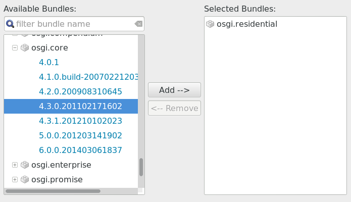

# Using a Service

A major benefit of using a framework is that you can reuse existing components in an architecturally well defined way. In this section we're going to use the OSGi logging service to improve the logging behavior of our simple bundle.

The OSGi framework manages the available services and makes them available via the [BundleContext](https://osgi.org/javadoc/r6/core/org/osgi/framework/BundleContext.html) interface. An implementation of the `BundleContext` is passed to the `start` method of the `BundleActivator`. Maybe you had noticed this parameter already in our activator implementation:

```
public class Activator implements BundleActivator {
    ...
    @Override
    public void start(BundleContext context) throws Exception {
        System.out.println("Hello World started.");
        helloWorld = new HelloWorld();
    }
    ...
}

```

The obvious choice for accessing a service is the `BundleContext.getService` method. It needs a `ServiceReference` parameter. Luckily, we can find a method `getServiceReference` right below the `getService` in the documentation. `ServiceReference` comes in two flavors. One takes the class as Java type, the other as a string. In both cases the class is presumably the main interface of the service that we want to use. The log service is part of all OSGi specifications, no matter whether they target residential or enterprise environments. [Download](https://www.osgi.org/developer/specifications/) either specification and have a look at the service description.

The full name of the log service interface is `org.osgi.service.log.LogService`. So let's try this code:

```
...
import org.osgi.service.log.LogService;

public class Activator implements BundleActivator {
    ...
    @Override
    public void start(BundleContext context) throws Exception {
        LogService logService = context.getServiceReference(
                context.getServiceReference(LogService.class));
        ....
    }
    ....
}
```

You should see several error markers. First of all, `LogService` is unknown. That's okay, because up to now, we only needed the OSGi core and had therefore only a jar with the core API in the classpath. Go to the "Build" tab of the `bnd.bnd` editor and add `osgi.residential` to the "Build Path". Save, and Bndtools updates the Eclipse project's library path accordingly.

Going back to the source, one error marker remains. The parameter of type `Class` is not accepted. Reading carefully through the method's [JavaDoc](https://osgi.org/javadoc/r6/core/org/osgi/framework/BundleContext.html#getServiceReference(java.lang.Class)), you will find that the flavor accepting this parameter only exists since version 1.6 of the API. This version was first included in the OSGi platform specification 4.3. So, if we want to use this method, we have to make sure that the environment provides at least this version. Managing application module's versions is one of the big topics of OSGi. If you come from building some simple Java application[^mv], this might surprise you. In an enterprise environment, however, this is definitely an issue. 

You may have noticed already that it is possible to choose versions when adding something to the build path in the Bndtools dialog (first, remove OSGi core again, else it won't be offered):

{: width="500px" }

Clicking "Add" results in an extended entry in `MANIFEST.MF`[^rl]:

```properties
Import-Package: org.osgi.framework;version="[1.6,2)"
```

The "version interval" uses the notation known from mathematics: at least version 1.6, higher versions (1.x) are okay, but the version must be less than 2.0[^ug].

Now that we know how to easily run oder debug an OSGi application from Eclipse (using the "Run" or "Debug" buttons on the "Run" tab of the `bnd.bnd` editor), we can check the effect of our statement simply by setting a breakpoint after it. Do this and start the application in debug mode. You should get: `Failed to start bundle SimpleBundle-logging-1.1.0, exception Unable to resolve SimpleBundle-logging [1](R 1.0): missing requirement [SimpleBundle-logging [1](R 1.0)] osgi.wiring.package; (&(osgi.wiring.package=org.osgi.service.log)(version>=1.3.0)(!(version>=2.0.0))) Unresolved requirements: [[SimpleBundle-logging [1](R 1.0)] osgi.wiring.package; (&(osgi.wiring.package=org.osgi.service.log)(version>=1.3.0)(!(version>=2.0.0)))]`.

Read the message carefully and try to understand it. You may encounter similar messages later when the cause is less obvious. Note how version constraints are translated to [filter](https://osgi.org/javadoc/r6/core/org/osgi/framework/Filter.html) expressions that can be easily evaluated by the framework. It's a quite intuitive prefix notation known from LDAP search filters.

What the message comes down to is that there is no logging service in the runtime environment. So go back to the "Run" tab of the `bnd.bnd` editor. Add `org.apache.felix.log` and debug again.

{: width="400px" }

When the program stops, have a look at the variable `logService`. If you're lucky, it has been assigned a value like `org.apache.felix.log.LogServiceImpl@45afc369`. You have to be lucky, because activation of services happens in no specific order. The fact that our bundle states a dependency on `org.osgi.service.log` in its `MANIFEST.MF` does not imply that the OSGi framework constructs a dependency graph and activates services with dependencies only after the services that they depend on have been activated[^dss]. This would only solve part of the problem anyway, because -- as we well know from playing around with the Felix console -- bundles (and the services that they provide) can be started and stopped at any time.


*To be continued*

---

[^mv]: Rule of thumb: get the latest versions of all libraries and hope that they provide backward compatibility for parts of the application built with older version, right? Well, often this works surprisingly well... 

[^rl]: Slightly simplified. If you have already added `osgi.residential` you actually see this:

    ```properties
    Import-Package: org.osgi.framework;version="[1.6,2)",org.osgi.service.log;version="[1.3,2)"
    ```

    Since `MANIFEST.MF` is basically a properties file, keys have to be unique. So if there are several imports, the value of the key `Import-Package` becomes an enumeration of imported packages.


[^ug]: The upper limit is an automatic guess, of course. If there will ever be a version 2.x of the API, chances are high that our code will still run. Usually, however, a change of the major version indicates some incompatible change of the API. So by excluding 2.0 and anything beyond, we're on the safe side. 

[^dss]: But this does sound alluring, doesn't it? Well, that's why OSGi has added such a concept as "Declarative Services". But let's stick to the "low level API" for now.